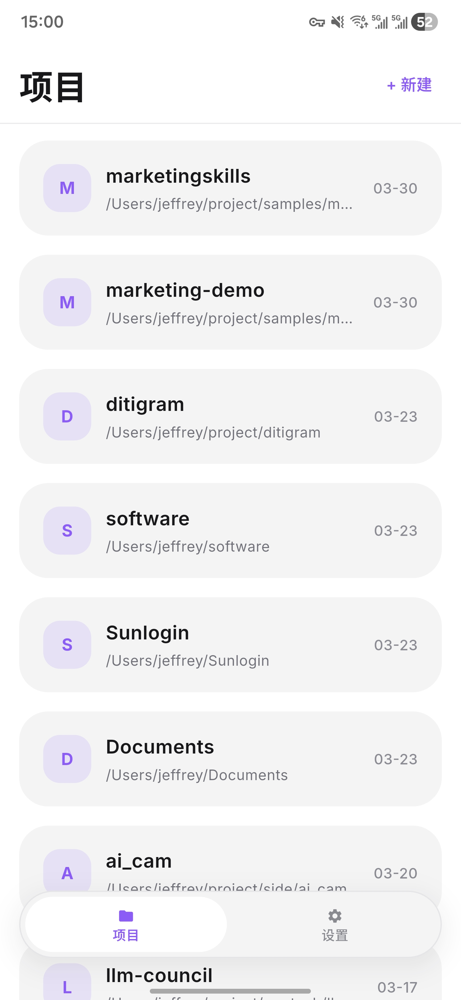
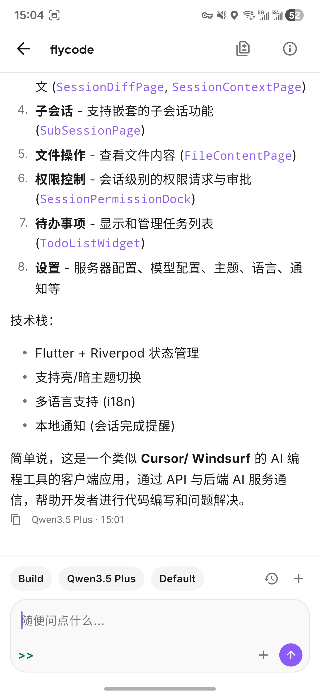
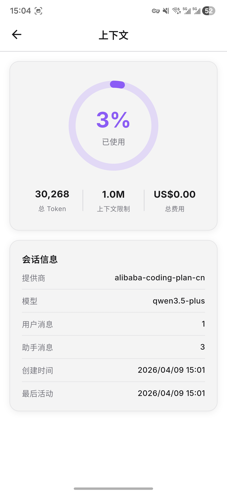

# FlyCode

[English](./README.md) | [简体中文](./README.zh-CN.md)

## Description and Screenshots

FlyCode 是一个面向 Android 和 iOS 的 `opencode` 移动客户端。你可以通过它连接自己的 `opencode server`，浏览项目、继续已有会话，并在移动端和 coding agent 协作。

> 使用 FlyCode 前，需要先启动 `opencode server`。
> 文档：https://opencode.ai/docs/server/

<p align="center">
  
  
  
  
</p>

## Features

- 支持连接 `opencode server`，可自定义服务地址，并支持可选认证
- 支持浏览项目，并快速进入新建或已有的编码会话
- 提供适合移动端的 agent 对话体验
- 可在应用内查看权限请求、Todo、Diff 和会话上下文
- 支持调整模型、语言、主题模式和通知偏好

## Use

1. 先启动你的 `opencode server`。

```bash
opencode serve
```

2. 默认服务地址是 `http://127.0.0.1:4096`。
3. 在设备上安装并打开 FlyCode。
4. 在应用内填入服务地址并完成连接。
5. 选择项目，进入会话，开始和 agent 协作。

服务端参考：

- 文档：https://opencode.ai/docs/server/
- 启动后的 OpenAPI 文档：`http://127.0.0.1:4096/doc`

## Build

如果你想自己构建 FlyCode，请先准备：

- Flutter SDK
- Dart SDK `^3.11.0`
- Android 或 iOS 对应的构建环境
- 一个可用于本地联调的 `opencode server`

安装依赖：

```bash
flutter pub get
```

运行应用：

```bash
flutter run
```

指定设备运行：

```bash
flutter devices
flutter run -d <device-id>
```

如果你修改了需要生成代码的 model 或 provider，再执行：

```bash
dart run build_runner build --delete-conflicting-outputs
```
